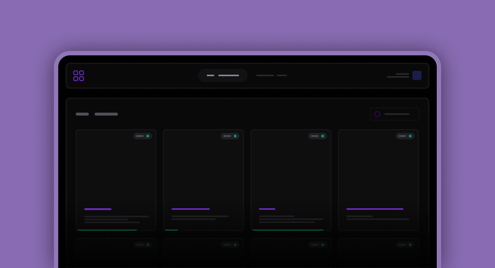

# Brev.ly Server



## Requisitos funcionais do Back-end

- Deve ser possível criar um link
  - Não deve ser possível criar um link com URL encurtada mal formatada
  - Não deve ser possível criar um link com URL encurtada já existente
- Deve ser possível deletar um link
- Deve ser possível obter a URL original por meio de uma URL encurtada
- Deve ser possível listar todas as URL’s cadastradas
- Deve ser possível incrementar a quantidade de acessos de um link
- Deve ser possível exportar os links criados em um CSV
  - Deve ser possível acessar o CSV por meio de uma CDN (Amazon S3, Cloudflare R2, etc)
  - Deve ser gerado um nome aleatório e único para o arquivo
  - Deve ser possível realizar a listagem de forma performática
  - O CSV deve ter campos como: URL original, URL encurtada, contagem de acessos e data de criação.

## Variáveis de ambiente

```yaml
PORT=
DATABASE_URL=

CLOUDFLARE_ACCOUNT_ID=""
CLOUDFLARE_ACCESS_KEY_ID=""
CLOUDFLARE_SECRET_ACCESS_KEY=""
CLOUDFLARE_BUCKET=""
CLOUDFLARE_PUBLIC_URL=""
```

## Instalação

### Pré-requisitos:

- Node.js v24.12 ou superior
- pnpm
- Docker
- Docker Compose

### Comandos:

#### Clonar projeto e acessar a pasta server

```bash
git clone git@github.com:Alexandresl/Brev.ly.git

cd brev.ly/server
```

#### Instalar dependências

```bash
pnpm install
```

#### Iniciar o banco de dados

```bash
docker-compose up -d
```

#### Migrar banco de dados

```bash
pnpm db:migrate
```

#### Iniciar o servidor

```bash
pnpm run dev
```

## Endpoints server

[http://localhost:3333/](http://localhost:3333/)

[http://localhost:3333/docs](http://localhost:3333/docs)

----------

[<- Voltar](README.md)